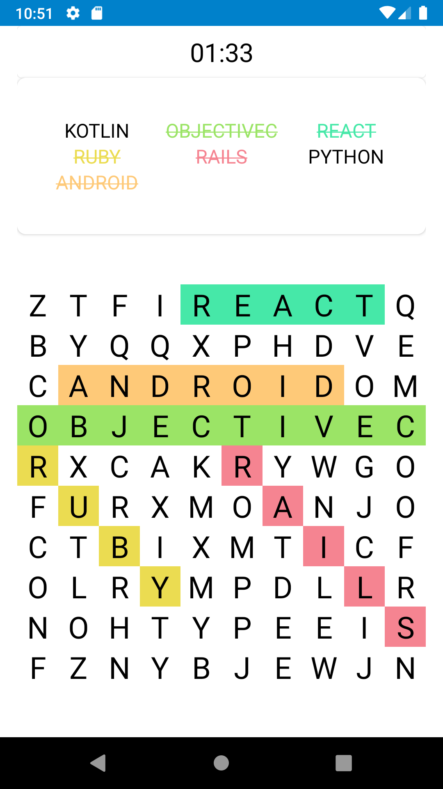

# WordSearch
A simple word search game!

Features list:
- Different grid sizes (5x5, 10x10, 15x15)
- Each puzzle is timed!

## Built With
Programmed in Kotlin using MVI archetecture along with the following libraries:

* [Hilt](https://dagger.dev/hilt/)
* [Material Design Components](https://material.io/components)
* [Picasso](https://square.github.io/picasso/)

## Getting Started

Follow these steps to run the app on an emulator!

### Prerequisites

- You will need to [install Android Studio](https://developer.android.com/studio/install)
- Next [create your emulator](https://developer.android.com/studio/run/managing-avds) in Android Studio

### Installation
1. Clone the repo
```sh
git clone https://github.com/fareed-ah/WordSearch.git
```
2. Open the cloned project in Android Studio

3. [Run the app on an emulator](https://developer.android.com/studio/run/emulator)

## Screenshots





